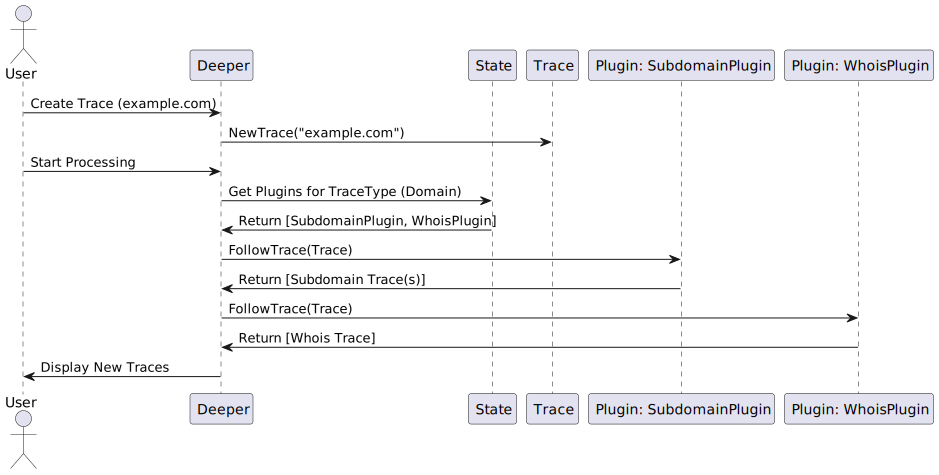

# Deeper

```
██████  ███████ ███████ ██████  ███████ ██████  
██   ██ ██      ██      ██   ██ ██      ██   ██ 
██   ██ █████   █████   ██████  █████   ██████  
██   ██ ██      ██      ██      ██      ██   ██ 
██████  ███████ ███████ ██      ███████ ██   ██ 
```

Deeper is an OSINT (Open Source Intelligence) tool designed to help users gather information from various online sources. The tool operates based on the concept of "traces." Each trace represents a piece of information such as an email, phone number, domain, or username. The tool leverages plugins to follow these traces, discovering new traces along the way. Each plugin specializes in processing a specific type of trace and produces new traces based on the input. This modular approach allows for easy extension and customization of the tool to suit various OSINT needs.

## Sequence Diagram



## Architecture overview


## How to Contribute

We welcome contributions from the community to help improve Deeper!

1. __Fork the Repository__:
   - Click the "Fork" button at the top right of the repository page.

2. __Create a New Branch__:
   - Clone your forked repository locally: `git clone https://github.com/your-username/deeper.git`
   - Create a new branch for your feature or bug fix: `git checkout -b feature-branch`

3. __Add Your Plugin Code__:
   - Add your new plugin code following the provided example.

4. __Commit Your Changes__:
   - Commit your changes with a descriptive message: `git commit -am 'Add new plugin'`

5. __Push to Your Branch__:
   - Push your changes to GitHub: `git push origin feature-branch`

6. __Create a New Pull Request__:
   - Go to the original repository and click the "New Pull Request" button.
   - Choose your branch and submit the pull request for review.

Thank you for your contributions!

## Plugin Example

Here is an example of how to create a new plugin for Deeper:

```go
package new_plugin

import (
    "github.com/smirnoffmg/deeper/internal/entities"
    "github.com/smirnoffmg/deeper/internal/state"
)

//Use the appropriate TraceType
const InputTraceType = entities.Username

func init() {
    p := NewPlugin()
    p.Register()
}

type NewPlugin struct{}

func NewPlugin() *NewPlugin {
    return &NewPlugin{}
}

func (g *NewPlugin) Register() error {
    state.RegisterPlugin(InputTraceType, g)
    return nil
}

func (g *NewPlugin) FollowTrace(trace entities.Trace) ([]entities.Trace, error) {
    if trace.Type != InputTraceType {
        return nil, nil
    }

    // Your logic for processing the trace
    var newTraces []entities.Trace
    // Example: Add a new trace based on the input trace
    newTraces = append(newTraces, entities.Trace{
        Value: "example_trace_value",
        Type:  InputTraceType,
    })
    return newTraces, nil
}

func (g NewPlugin) String() string {
    return "NewPlugin"
}
```

## To-do list

- [ ] BitcoinAddress -> Blockchain Analysis
- [ ] BitcoinAddress -> Transactions Analysis
- [ ] BitcoinAddress -> Transactions, Associated Wallets
- [ ] BitcoinAddress -> Wallet Balance
- [ ] Company -> Company Details, Employee Emails
- [ ] DnsRecord -> Subdomain, IpAddr
- [ ] Domain -> AAAA Records
- [ ] Domain -> CNAME Records
- [ ] Domain -> MX Records
- [ ] Domain -> NS Records
- [ ] Domain -> PTR Records
- [ ] Domain -> Redirect Chains
- [ ] Domain -> Reverse DNS
- [ ] Domain -> Sitelinks
- [ ] Domain -> SOA Records
- [ ] Domain -> SPF Records
- [ ] Domain -> SSL Certificates
- [x] Domain -> Subdomain Enumeration
- [ ] Domain -> Subdomain, IpAddr
- [ ] Domain -> TXT Records
- [ ] Domain -> Web Technologies
- [ ] Domain -> WHOIS History
- [ ] Domain -> WHOIS Information
- [ ] Domain -> Zone Transfers
- [ ] Email -> Academic Papers
- [ ] Email -> Associated Domains
- [ ] Email -> Data Aggregators
- [ ] Email -> Data Breaches
- [ ] Email -> Data Mining
- [ ] Email -> Email Verification
- [ ] Email -> Facebook Profiles
- [ ] Email -> Google Scholar Profiles
- [ ] Email -> Gravatar
- [ ] Email -> LinkedIn Connections
- [ ] Email -> LinkedIn Profiles
- [ ] Email -> Public Record Search
- [ ] Email -> Reverse Email Search
- [ ] Email -> Snapchat Profiles
- [ ] Email -> Social Media Profiles
- [ ] Email -> Twitter Profiles
- [ ] ExifData -> Geolocation, Device Information
- [ ] Geolocation -> Nearby Facilities
- [ ] IpAddr -> Abuse Reports
- [ ] IpAddr -> ASN Information
- [ ] IpAddr -> DNS Lookup
- [ ] IpAddr -> Domain Names
- [ ] IpAddr -> Geolocation, ASN
- [ ] IpAddr -> Hosting Provider
- [ ] IpAddr -> IP Geolocation
- [ ] IpAddr -> IP History
- [ ] IpAddr -> Network Info
- [ ] IpAddr -> Port Scan
- [ ] IpAddr -> Service Detection
- [ ] IpAddr -> Threat Intelligence
- [ ] IpAddr -> Traffic Analysis
- [ ] IpAddr -> WHOIS Info
- [ ] MacAddr -> Device Information
- [ ] Name -> Academic Publications
- [ ] Name -> Address History
- [ ] Name -> Business Records
- [ ] Name -> Facebook Profiles
- [ ] Name -> Google Scholar Profiles
- [ ] Name -> Instagram Profiles
- [ ] Name -> LinkedIn Profiles
- [ ] Name -> Public Records
- [ ] Name -> Relatives
- [ ] Name -> Social Media Profiles, Public Records
- [ ] PayPalAccount -> Transactions
- [ ] Phone -> Business Listings
- [ ] Phone -> Carrier Info
- [ ] Phone -> Data Breaches
- [ ] Phone -> Location
- [ ] Phone -> Nuisance Reports
- [ ] Phone -> Public Directories
- [ ] Phone -> Public Profiles
- [ ] Phone -> Skype Profiles
- [ ] Phone -> Social Media Profiles
- [ ] Phone -> Telegram Profiles
- [ ] Phone -> Verification Services
- [ ] Phone -> WhatsApp Profiles
- [ ] Phone -> White Pages
- [ ] Subdomain -> Associated Domains
- [ ] Subdomain -> IP Addresses
- [ ] Subdomain -> IpAddr, DnsRecord
- [ ] Subdomain -> Reverse DNS
- [ ] Subdomain -> Security Reports
- [ ] Subdomain -> SOA Records
- [ ] Subdomain -> SPF Records
- [ ] Url -> Archived Pages
- [ ] Url -> Domain, Subdomain
- [x] Username -> Code Repositories
- [ ] Username -> Data Breaches
- [ ] Username -> DeviantArt Profiles
- [ ] Username -> Email Addresses
- [ ] Username -> Facebook Profiles
- [ ] Username -> GitHub Repos
- [ ] Username -> Instagram Profiles
- [ ] Username -> LinkedIn Profiles
- [ ] Username -> Medium Profiles
- [ ] Username -> Pastebin Dumps
- [ ] Username -> Pinterest Profiles
- [ ] Username -> Quora Profiles
- [ ] Username -> Reddit Profiles
- [ ] Username -> Social Media Profiles
- [ ] Username -> Social Mention
- [ ] Username -> Steam Profiles
- [ ] Username -> Tumblr Profiles
- [ ] Username -> Twitter Profiles
