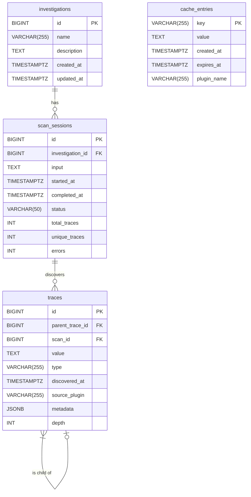

# Database Design Documentation

This document outlines the database architecture for Deeper, covering the schema, relationships, performance considerations, and migration strategy. The design supports storing traces, investigations, and their associated metadata.

## 1. Entity-Relationship Diagram (ERD)

The following diagram illustrates the relationships between the main entities in the database.



## 2. Database Schema

The schema is designed to be portable but is described here using PostgreSQL-style data types for clarity and performance (e.g., `TIMESTAMPTZ`, `JSONB`). These can be adapted for other SQL databases like SQLite.

### `investigations` Table

Stores high-level information about an investigation, which can encompass multiple scan sessions.

| Column      | Data Type     | Constraints | Description                                         |
|-------------|---------------|-------------|-----------------------------------------------------|
| `id`        | `BIGSERIAL`   | `PRIMARY KEY` | Unique identifier for the investigation.            |
| `name`        | `VARCHAR(255)`| `NOT NULL`  | A user-friendly name for the investigation.         |
| `description` | `TEXT`        |             | A detailed description of the investigation's scope.|
| `created_at`  | `TIMESTAMPTZ` | `DEFAULT NOW()` | Timestamp of when the investigation was created.    |
| `updated_at`  | `TIMESTAMPTZ` | `DEFAULT NOW()` | Timestamp of the last update to the investigation.|

### `scan_sessions` Table

Represents a single execution of the Deeper tool, tied to a specific investigation.

| Column           | Data Type     | Constraints | Description                                               |
|------------------|---------------|-------------|-----------------------------------------------------------|
| `id`             | `BIGSERIAL`   | `PRIMARY KEY` | Unique identifier for the scan session.                   |
| `investigation_id`| `BIGINT`     | `FK`        | Links to the `investigations` table (`ON DELETE SET NULL`). |
| `input`          | `TEXT`        | `NOT NULL`  | The initial input trace for the scan session.             |
| `started_at`     | `TIMESTAMPTZ` | `DEFAULT NOW()` | Timestamp of when the scan started.                       |
| `completed_at`   | `TIMESTAMPTZ` |             | Timestamp of when the scan completed.                     |
| `status`         | `VARCHAR(50)` |             | The current status (e.g., `running`, `completed`, `failed`).|
| `total_traces`   | `INTEGER`     |             | The total number of traces found in the scan.             |
| `unique_traces`  | `INTEGER`     |             | The number of unique traces found.                        |
| `errors`         | `INTEGER`     |             | The number of errors encountered during the scan.         |

### `traces` Table

Stores individual pieces of information (traces) discovered during a scan. This is the core table of the database.

| Column          | Data Type      | Constraints      | Description                                                    |
|-----------------|----------------|------------------|----------------------------------------------------------------|
| `id`            | `BIGSERIAL`    | `PRIMARY KEY`      | Unique identifier for the trace.                               |
| `parent_trace_id`| `BIGINT`      | `FK`             | The ID of the trace that led to this one, establishing lineage.  |
| `scan_id`       | `BIGINT`       | `FK`             | Links to the `scan_sessions` table (`ON DELETE CASCADE`).      |
| `value`         | `TEXT`         | `NOT NULL`       | The value of the trace (e.g., an email address, a domain name).  |
| `type`          | `VARCHAR(255)` | `NOT NULL`       | The type of the trace (e.g., `email`, `domain`).               |
| `discovered_at` | `TIMESTAMPTZ`  | `DEFAULT NOW()`  | Timestamp of when the trace was discovered.                    |
| `source_plugin` | `VARCHAR(255)` |                  | The name of the plugin that discovered the trace.              |
| `metadata`      | `JSONB`        |                  | Flexible field for storing additional data as JSON.            |
| `depth`         | `INTEGER`      |                  | The depth of the trace in the discovery chain (root is 0).     |
|                 |                | `UNIQUE(value, type, scan_id)` | Ensures a trace is unique within a single scan. |

### `cache_entries` Table

Stores cached results from plugins to avoid redundant work.

| Column      | Data Type     | Constraints | Description                               |
|-------------|---------------|-------------|-------------------------------------------|
| `key`       | `VARCHAR(255)`| `PRIMARY KEY` | Unique key for the cache entry.           |
| `value`     | `TEXT`        | `NOT NULL`  | The cached result data.                   |
| `created_at`| `TIMESTAMPTZ` | `DEFAULT NOW()` | Timestamp of when the entry was created.  |
| `expires_at`| `TIMESTAMPTZ` |             | Timestamp of when the entry should expire.|
| `plugin_name`|`VARCHAR(255)` | `NOT NULL`  | The name of the plugin that owns the cache entry. |

## 3. Performance Requirements and Indexing Strategy

To ensure efficient data retrieval, the following indexing strategy is proposed:

- **`investigations` table:**
  - An index on `name` might be useful if users frequently search for investigations by name.

- **`scan_sessions` table:**
  - `CREATE INDEX idx_scan_sessions_investigation_id ON scan_sessions(investigation_id);` (essential for joining with `investigations`)
  - `CREATE INDEX idx_scan_sessions_status ON scan_sessions(status);` (for quickly finding sessions with a specific status)

- **`traces` table:**
  - `CREATE INDEX idx_traces_parent_trace_id ON traces(parent_trace_id);` (crucial for traversing the trace lineage)
  - `CREATE INDEX idx_traces_scan_id ON traces(scan_id);` (for retrieving all traces for a given scan)
  - `CREATE INDEX idx_traces_type ON traces(type);` (for queries that filter by trace type)
  - `CREATE INDEX idx_traces_value ON traces(value);` (if searching for specific trace values is a common operation)
  - For the `metadata` field, if specific keys are frequently queried, a GIN index can be used in PostgreSQL: `CREATE INDEX idx_traces_metadata ON traces USING GIN(metadata);`

- **`cache_entries` table:**
  - `CREATE INDEX idx_cache_entries_expires_at ON cache_entries(expires_at);` (for cleaning up expired entries)
  - `CREATE INDEX idx_cache_entries_plugin_name ON cache_entries(plugin_name);`

## 4. Migration Framework Design

The current migration approach (hardcoded SQL strings in `database.go`) is not suitable for a growing application. A more robust migration framework is necessary.

### Recommended Tool: `golang-migrate/migrate`

- **Why?** It's a widely-used, database-agnostic migration tool for Go projects. It supports sourcing migrations from files, which is a best practice.
- **Features:**
    - CLI and library usage.
    - Supports a wide range of databases.
    - Versioned migrations (up and down).
    - Atomic migrations (on databases that support it).

### Migration Workflow

1.  **Create a Migration:**
    - Use the `migrate` CLI to create a new SQL migration file:
      ```bash
      migrate create -ext sql -dir internal/pkg/database/migrations -seq add_investigations_table
      ```
    - This will generate two files: `..._add_investigations_table.up.sql` and `..._add_investigations_table.down.sql`.

2.  **Write the Migration:**
    - **`up.sql`:** Contains the `CREATE TABLE` or other schema changes.
    - **`down.sql`:** Contains the `DROP TABLE` or other statements to revert the change.

3.  **Apply Migrations:**
    - Migrations can be applied at application startup using the library. The `NewDatabase` function would be modified to run the migrations from the `migrations` directory.
    - This ensures that the database schema is always up-to-date when the application starts.

4.  **Directory Structure:**
    ```
    internal/pkg/database/
    ├── migrations/
    │   ├── 0001_initial_schema.up.sql
    │   ├── 0001_initial_schema.down.sql
    │   └── ...
    ├── database.go
    └── models.go
    ```

This approach provides a clear, version-controlled history of schema changes and a reliable mechanism for keeping the database schema in sync with the application's expectations.
